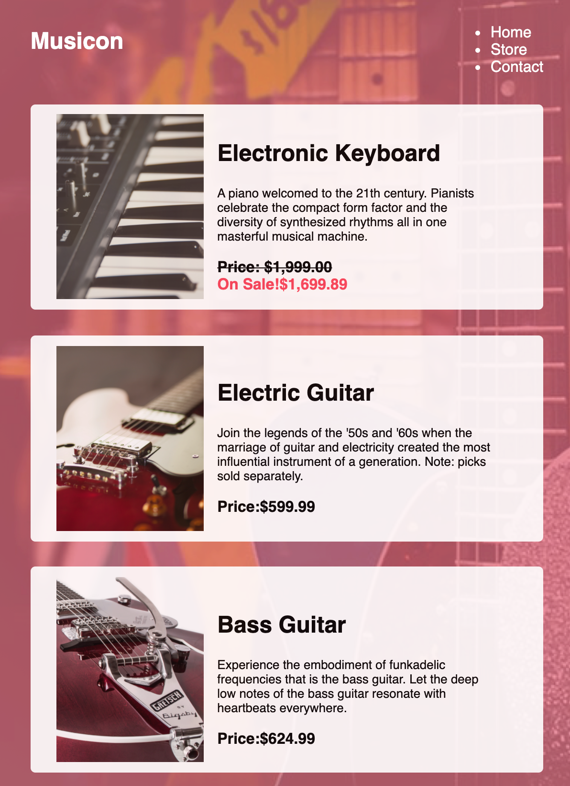

# Musicon

## Description

```
 Musicon is a budding musical storefront with a mission to share the joy of music. These magnificent auditory tools are designed with musical creators, like you, in mind. Hobbyists, beginners, and experts alike can appreciate the resplendent sounds supplied by each and every instrument we carry. Join us in delivering the euphoric vibrations of melodia to the citizens of the world!

```

## Technology used

Musicon will have three separate web pages: a home page, a store page, and a contacts page. The home and store pages. It incorporated three languages,which are

- HTML
- CSS
- JavaScript

## Outcome





## Deployed link

[Website](https://yinping-520.github.io/musicon/contact.html)

## Github Repo

[Github repo](https://github.com/yinping-520/musicon)
